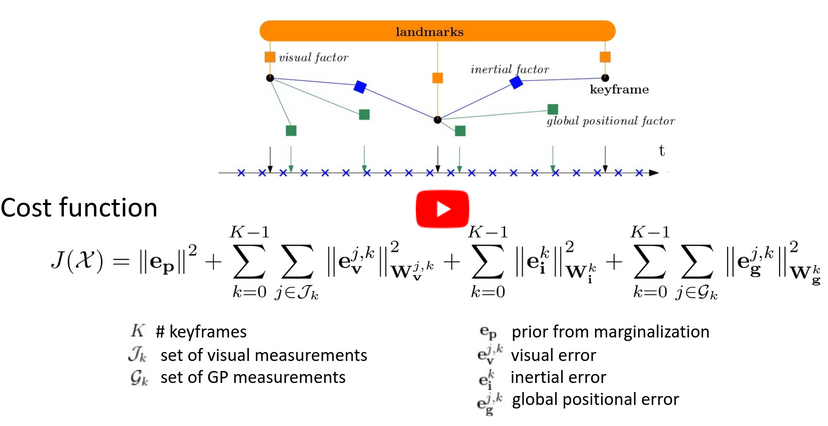

# Tightly-coupled Fusion of Global Position Measurements in SVO Pro

[](https://youtu.be/jC_KiRLs6CY)

This repo contains a sliding-window optimization-based odometry system fusing visual, inertial and global position measurements. 
It builds on top of the visual-inertial odometry algorithm [SVO Pro](https://github.com/uzh-rpg/rpg_svo_pro_open).

## Publication
If you use this code in an academic context, please cite the following [IROS 2020 paper](https://rpg.ifi.uzh.ch/docs/IROS20_Cioffi.pdf).

G. Cioffi and D. Scaramuzza,
"**Tightly-coupled Fusion of Global Positional Measurements in Optimization-based Visual-Inertial Odometry**,"
IEEE/RSJ International Conference on Intelligent Robots and Systems (IROS). 2020.

```
@InProceedings{cioffi2020tightly,
  author={Cioffi, Giovanni and Scaramuzza, Davide},
  title={Tightly-coupled fusion of global positional measurements in optimization-based visual-inertial odometry},
  booktitle={2020 IEEE/RSJ International Conference on Intelligent Robots and Systems (IROS)},
  pages={5089--5095},
  organization={IEEE},
  year = {2020}
}
```

## Install

The code has been tested on

* Ubuntu 18.04 with ROS Melodic
* Ubuntu 20.04 with ROS Noetic

### Install dependences

Install [catkin tools](https://catkin-tools.readthedocs.io/en/latest/installing.html) and [vcstools](https://github.com/dirk-thomas/vcstool) if you haven't done so before. Depending on your operating system, run
```sh
# For Ubuntu 18.04 + Melodic
sudo apt-get install python-catkin-tools python-vcstool
```
or
```sh
# For Ubuntu 20.04 + Noetic
sudo apt-get install python3-catkin-tools python3-vcstool python3-osrf-pycommon
```
Install system dependencies and dependencies for Ceres Solver
```sh
# system dep.
sudo apt-get install libglew-dev libopencv-dev libyaml-cpp-dev 
# Ceres dep.
sudo apt-get install libblas-dev liblapack-dev libsuitesparse-dev
```

### Clone and compile

Create a workspace and clone the code (`ROS-DISTRO`=`melodic`/`noetic`):
```sh
mkdir svo_gps_ws && cd svo_gps_ws
catkin config --init --mkdirs --extend /opt/ros/<ROS-DISTRO> --cmake-args -DCMAKE_BUILD_TYPE=Release
cd src
git clone git@github.com:uzh-rpg/rpg_svo_pro_gps.git
vcs-import < ./rpg_svo_pro_gps/dependencies.yaml
touch minkindr/minkindr_python/CATKIN_IGNORE
catkin build
```

### Trobleshooting

Refer to [SVO Pro](https://github.com/uzh-rpg/rpg_svo_pro_open#troubleshooting).

## Instructions

We provide here and example on how to run the code on the MH_01 sequence of the [EuRoC dataset](https://projects.asl.ethz.ch/datasets/doku.php?id=kmavvisualinertialdatasets).

Download from [here](https://download.ifi.uzh.ch/rpg/svo_pro_gps/) a rosbag containing data of the MH_01 sequence including simulated global position measurements. 
This is the [script](https://github.com/uzh-rpg/rpg_svo_pro_gps/blob/master/scripts/python/include_simulated_gp_in_rosbag.py) used to create such a rosbag. 
This is the [script](https://github.com/uzh-rpg/rpg_svo_pro_gps/tree/master/svo_benchmarking/dataset_tools#extract-groundtruth) used to convert the ground truth from the EuRoC format to our format.
The global position measurements are obtained from adding Gaussian noise (mean = 0.0, std = 0.20) to the ground truth.


### Monocular Camera Configuration

```sh
# Terminal 1: launch the pipeline
roslaunch svo_ros euroc_vio_gp_mono.launch

# Terminal 2: run the rosbag
rosbag play MH_01_easy_with_gp.bag

# (Optional) Terminal 3: Record estimates in a rosbag
cd svo_gps_ws/src/rpg_svo_pro_gps/scripts/bash
./record_vio.sh desired-path
```

### Stereo Camera Configuration

```sh
# Terminal 1: launch the pipeline
roslaunch svo_ros euroc_vio_gp_stereo.launch

# Terminal 2: run the rosbag
rosbag play MH_01_easy_with_gp.bag

# (Optional) Terminal 3: Record estimates in a rosbag
cd svo_gps_ws/src/rpg_svo_pro_gps/scripts/bash
./record_vio.sh desired-path
```

## Credits

The VIO system used in this repo is based on [SVO Pro](https://github.com/uzh-rpg/rpg_svo_pro_open). Check [SVO Pro](https://github.com/uzh-rpg/rpg_svo_pro_open) for the full list of aknowledgments.

## License

The code is licensed under GPLv3. For commercial use, please contact the authors at cioffi@ifi.uzh.ch and sdavide@ifi.uzh.ch.

Check [SVO Pro](https://github.com/uzh-rpg/rpg_svo_pro_open) for licenses of the external dependencies.